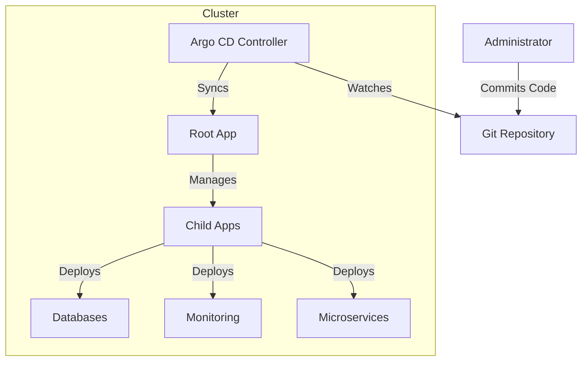

# Argo CD and the App of Apps Pattern

## What is Argo CD?

Argo CD is a **GitOps** continuous delivery tool for Kubernetes.

**GitOps** means that we use Git as the single source of truth for our infrastructure and applications. Instead of running manual commands (`kubectl apply...`) or using complex CI scripts to push changes to the cluster, we simply commit changes to our Git repository.

### Why are we using it?

1.  **Automation:** Argo CD automatically syncs your cluster state with the Git repository.
2.  **Visibility:** It provides a user-friendly web UI to visualize the entire application stack.
3.  **Reliability:** It ensures that what is running in production is exactly what was approved in the code review.

## The "App-of-Apps" Pattern

Managing a few microservices is easy. Managing hundreds of services, databases, and infrastructure components requires a structured approach. We use the **App-of-Apps** pattern to organize our deployments.

In this pattern, we treat the entire cluster configuration as a hierarchical tree:

1.  **Root Application:** There is a "master" application per cluster (e.g., `root-app-bp-dsk.yaml`). Its only job is to point to a folder containing other application definitions.
2.  **Child Applications:** These are the actual definitions for our Database stack, Monitoring stack, and Business Microservices.
3.  **Recursive Management:** When the Root App syncs, it creates the Child Apps. When a Child App syncs, it creates the actual Kubernetes resources (Pods, Services, etc.).

## Why use this approach?

### 1. Single Source of Truth
The state of the cluster always matches what is in this Git repository. If someone manually changes something in the cluster (e.g., deletes a service), Argo CD detects the "drift" and automatically corrects it (Self-Healing).

### 2. Scalability and Modularity
Instead of one giant file defining everything, we split components into logical groups:
-   **Platform:** Shared infrastructure like Databases (`data`) and Monitoring (`monitoring`).
-   **Apps:** The actual business applications.

This modularity allows teams to work on specific parts without affecting the whole system. Adding a new application is as simple as adding one file to the appropriate cluster folder.

### 3. Disaster Recovery
Because the entire setup is code, recreating the entire environment from scratch is extremely fast. We simply bootstrap the cluster and apply the relevant Root Application. The system will then recursively install everything else.

## High-Level Diagram

