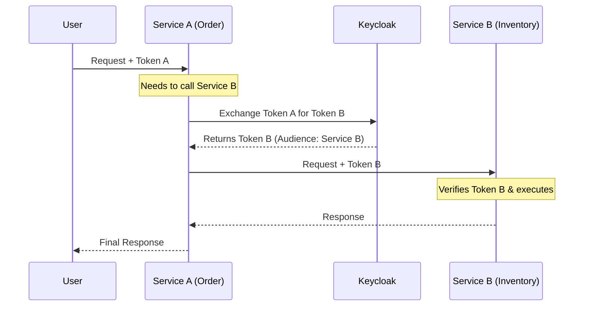

# Keycloak: Identity and Access Management

## Role of Keycloak

Keycloak is our centralized **Identity and Access Management (IAM)** solution. It secures our microservices by handling:
-   **Authentication:** Verifying who the user is (Login).
-   **Authorization:** Verifying what the user is allowed to do (Permissions).
-   **Single Sign-On (SSO):** Users log in once and gain access to all authorized applications.

## Current Setup

We currently host Keycloak within our Kubernetes cluster.
-   **Database:** It uses a dedicated PostgreSQL database running in the `auth` namespace.
-   **Deployment:** Managed via Helm and Argo CD.
-   **Configuration:** We have enabled advanced features like **Token Exchange** to support complex service-to-service interactions.

## Future Roadmap: Azure EntraID Integration

While we currently manage users directly in Keycloak (or a local LDAP), the future goal is to integrate with **Azure EntraID** (formerly Azure AD).

Keycloak will act as an **Identity Broker**:
1.  The user attempts to log in.
2.  Keycloak redirects the user to Azure EntraID.
3.  The user logs in with their corporate Microsoft credentials.
4.  Azure EntraID confirms the identity to Keycloak.
5.  Keycloak issues a token to the application.

This ensures we can use corporate credentials while keeping our applications decoupled from specific Azure implementation details.

## Service-to-Service Security: "On-Behalf-Of" Flow

In a microservice architecture, one service often needs to call another service *on behalf of the user*.

**Example:**
1.  User calls the **Frontend**.
2.  Frontend calls the **Order Service**.
3.  Order Service needs to call the **Inventory Service** to check stock.

The Inventory Service needs to know *who* initiated the request to enforce permissions (e.g., "Can this user see inventory?"). We use the **Token Exchange** pattern for this.

### How it works (The On-Behalf-Of Flow)

1.  **User** logs in and gets an Access Token (Token A).
2.  **User** sends a request to **Service A** with Token A.
3.  **Service A** needs to call **Service B**. It cannot just pass Token A (security best practice).
4.  **Service A** asks **Keycloak**: "Here is Token A. Please give me a new token (Token B) that allows me (Service A) to talk to Service B on behalf of this user."
5.  **Keycloak** verifies permissions and issues Token B.
6.  **Service A** calls **Service B** using Token B.

### Diagram

