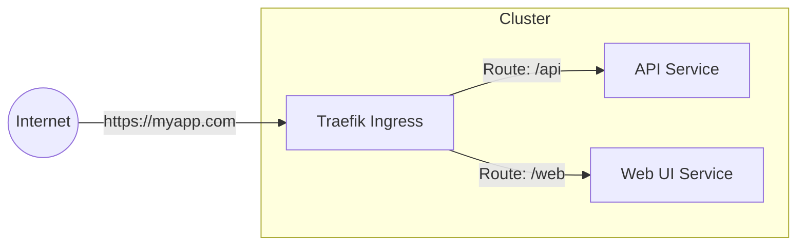

# Kubernetes: The Foundation

## What is Kubernetes?

Kubernetes (often called K8s) is an open-source system for automating the deployment, scaling, and management of containerized applications. Think of it as a **Data Center Operating System**. Instead of managing individual servers, we give Kubernetes a pool of resources (CPU, Memory) and tell it to run our applications.

## Key Concepts

### 1. Pods
The **Pod** is the smallest deployable unit in Kubernetes. A Pod represents a single instance of a running process in your cluster. Usually, one Pod contains one container (like your application), but it can contain helper containers.

*   **Ephemeral:** Pods are mortal. They are created, they die, and they are replaced. We never rely on a specific Pod instance being around forever.

### 2. Services
Since Pods come and go, their IP addresses change. A **Service** is a stable address (like a phone number) that sits in front of a group of Pods. When other applications want to talk to your app, they call the Service, which forwards the call to one of the available Pods.

### Conceptual Diagram

```mermaid
graph TD
    Client[User / Other App] -->|Calls| Svc[Service (Stable IP)]
    Svc -->|Load Balances| Pod1[Pod A (Instance 1)]
    Svc -->|Load Balances| Pod2[Pod A (Instance 2)]
    Svc -->|Load Balances| Pod3[Pod A (Instance 3)]

    style Svc fill:#f9f,stroke:#333,stroke-width:4px
    style Pod1 fill:#ccf,stroke:#333
    style Pod2 fill:#ccf,stroke:#333
    style Pod3 fill:#ccf,stroke:#333
```

## How We Configure It: YAML and Helm

### YAML Files
Kubernetes is "declarative". This means we describe *what* we want in a text file (using YAML format), and Kubernetes makes it happen.
*   **Example:** "I want 3 copies of the Login Service running."
*   If one crashes, Kubernetes sees there are only 2, and starts a new one to get back to 3.

### Helm Charts
Writing raw YAML for every application is tedious and error-prone. **Helm** is a package manager for Kubernetes (like an App Store).
*   **Chart:** A package containing all the resource definitions necessary to run an application, tool, or service inside of a Kubernetes cluster.
*   **Value:** We can customize the chart using a simple configuration file (values.yaml). For example, we use a standard "Microservice Chart" and just plug in the image name and port for each of our apps.

## Accessing Services

There are two main ways to access applications running inside the cluster.

### 1. Port Forwarding (For Debugging)
This creates a direct tunnel from your local laptop to a specific service in the cluster. It is secure and temporary.

*   **Command:**
    ```bash
    kubectl port-forward service/my-service 8080:80
    ```
*   **Result:** You can open `http://localhost:8080` in your browser.

### 2. Ingress via Traefik (For Production/General Use)
**Ingress** is a door from the outside world into the cluster. We use **Traefik** as our Ingress Controller (which comes standard with our K3s distribution).
Traefik acts as a smart router. It looks at the incoming URL (e.g., `https://myapp.platform.com`) and routes the traffic to the correct Service inside the cluster.


