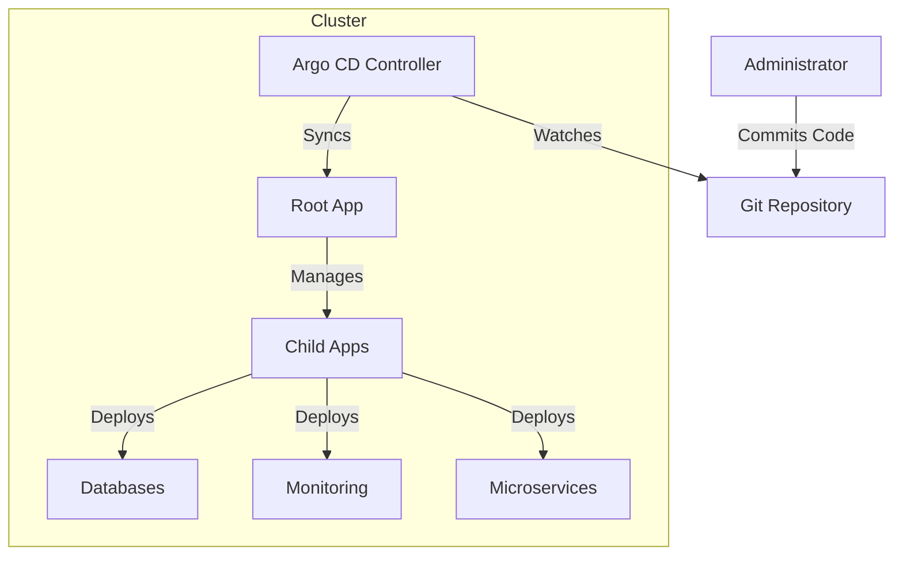

# Overview: The "App-of-Apps" Pattern

## Introduction

This repository manages our Kubernetes infrastructure and applications using a pattern known as **"App-of-Apps"**, implemented with **Argo CD**.

This document explains the high-level concepts and benefits of this approach for stakeholders and managers.

## What is "App-of-Apps"?

In a traditional setup, you might manually deploy each application or have a separate pipeline for every service. As the number of services grows, this becomes hard to manage, visualize, and audit.

The **App-of-Apps** pattern treats the entire cluster state as a hierarchical tree of applications.

1.  **Root Application:** There is one "master" application (defined in `root-app.yaml`) that is responsible for only one thing: finding other applications.
2.  **Child Applications:** The root app points to a folder (`apps/templates`) containing definitions for other applications (like Database, Monitoring, Microservices).
3.  **Infrastructure as Code (IaC):** Every change to the cluster (adding a service, changing a configuration, updating a version) is done by changing a file in this Git repository.

## Why use this approach?

### 1. Single Source of Truth
The state of the cluster always matches what is in this Git repository. If you want to know what is running, you check the code. If someone manually changes something in the cluster, Argo CD detects the "drift" and can automatically correct it back to the state defined in Git.

### 2. Scalability and Modularity
Instead of one giant file defining everything, we split components into logical groups:
-   **Platform:** Shared infrastructure like Databases (`data`) and Monitoring (`monitoring`).
-   **Apps:** The actual business applications.

This modularity allows teams to work on specific parts without affecting the whole system. Adding a new application is as simple as adding one file.

### 3. Automated Updates & Self-Healing
Argo CD constantly watches this repository.
-   **Updates:** When a developer pushes a change (e.g., a new image version), Argo CD sees the change and updates the cluster automatically.
-   **Self-Healing:** If a resource is deleted by mistake in the cluster, Argo CD sees that it is missing (compared to the Git repo) and recreates it.

### 4. Disaster Recovery
Because the entire setup is code, recreating the entire environment from scratch is extremely fast. We simply bootstrap the cluster and apply the `root-app.yaml`. The system will then recursively install everything else.

## High-Level Diagram

